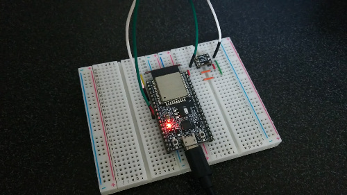
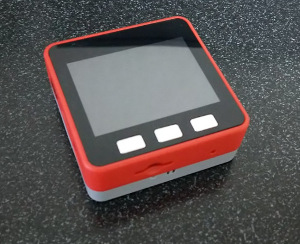
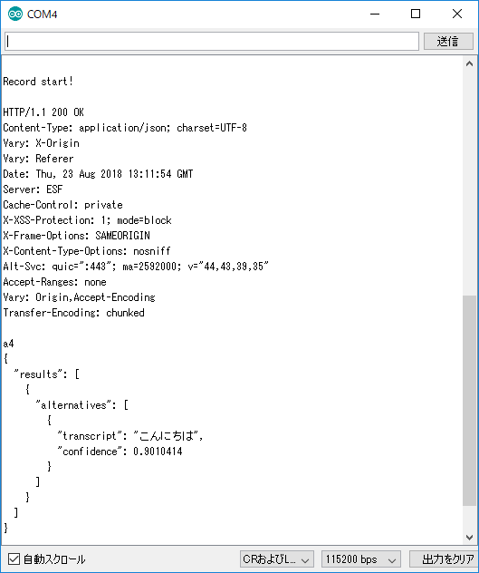
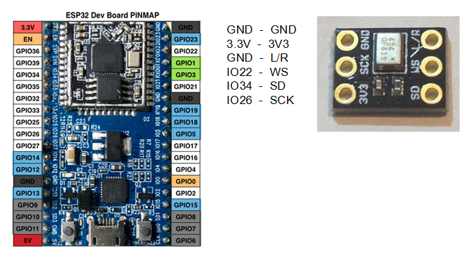

# esp32_CloudSpeech
Let's try voice recognition by machine learning! 
Transcribe your voice by Google's Cloud Speech-to-Text API with esp32   
In the case of esp32 + microphone 
   
In the case of M5Stack FIRE 
   
Serial monitor 
 
 
## Prepare
- [ESP32-DevKitC](https://www.espressif.com/en/products/hardware/esp32-devkitc/overview)  (espressif)
- Microphone :  
 [ICS43434](https://www.tindie.com/products/onehorse/ics43434-i2s-digital-microphone/) (tindie),  
 or [AE-ADMP441_K](http://akizukidenshi.com/catalog/g/gK-06864/) (Akizuki Denshi),  
 or similar product   
 Or  
- [M5Stack FIRE](https://www.switch-science.com/catalog/3953/) (Switch Science) - This product includes esp32 and microphone.

## Wiring
  
  
 *No need wiring if you use M5Stack FIRE.

## Development Environment
- [Arduino IDE](https://www.arduino.cc/en/main/software)
- [arduino-esp32](https://github.com/espressif/arduino-esp32)

## How to use
Get your account in https://cloud.google.com/speech-to-text/  
Set network parameter and your account information in network_param.h. 
Say to the microphone and see serial monitor.
